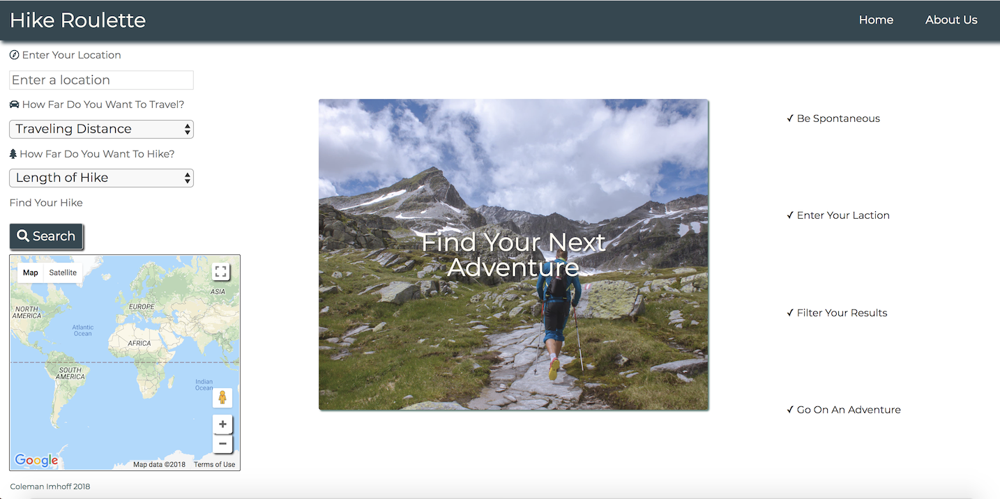

# Hike Roulette

## Description

Hike Roulette provides access hiking trails based on a user's location. Its takes away the pressure of scouring the internet for the perfect hike and instead provides an opportunity for real uninhibited adventure.

## Technologies

Built With Javascript, HTML, and CSS

Coming Soon in React.js!

## Visit Website

[Link to Deployed Site](https://hike-roulette.firebaseapp.com/)

## Getting Started
 
1. Click [here](https://hike-roulette.firebaseapp.com/).
2. Type in your city.
3. Choose how far you want to travel.
4. Choose how far you want to hike.
5. Click [here](https://www.youtube.com/watch?v=A6SpcmAkPlo) for a video demo.

## Technologies

Built with Vanilla JavaScript, HTML, CSS, as well as Google Maps API and REI API.

## License

See MIT License

### Created by Coleman Imhoff
[LinkedIn](https://www.linkedin.com/in/colemanimhoff/)
colemanimhoff@gmail.com
